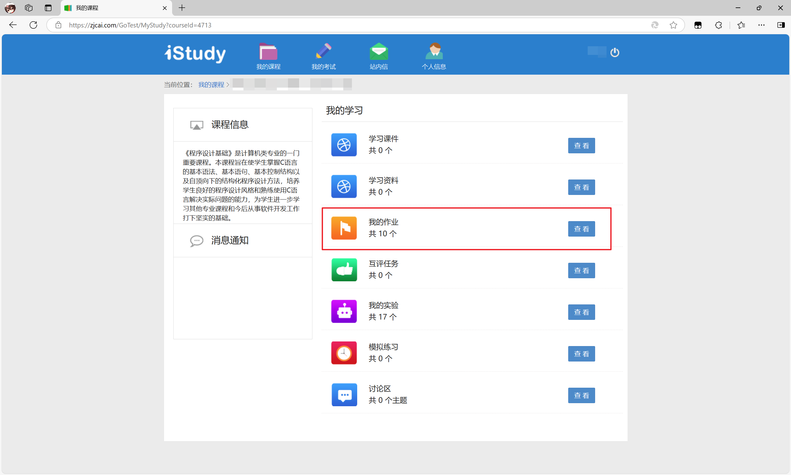
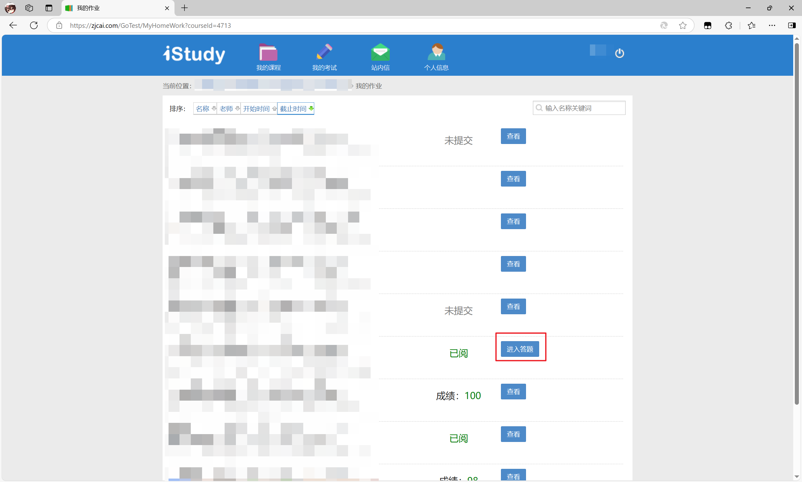
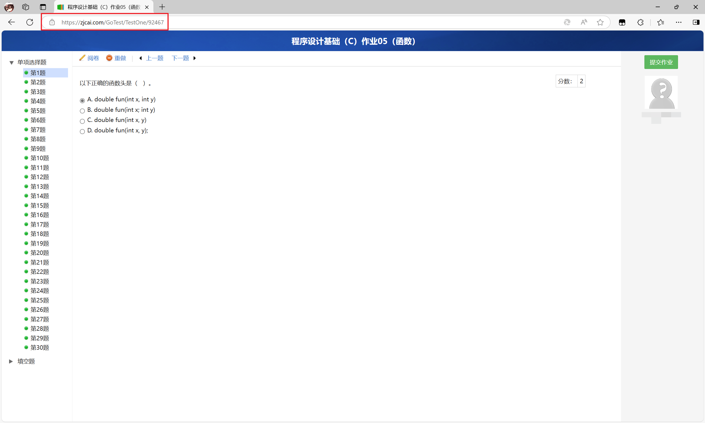
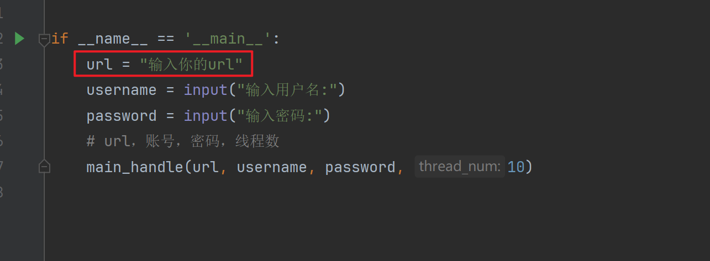

# zjcai-iStudy-solution

www.zjcai.com网站，iSudy计算机教学实验考试平台作业通解脚本


这个代码使用起来十分简单，只需要把python文件 `zjcai_solution.py` 下载到本地即可

需要先安装[python](https://www.python.org)

需要用到的库只有

* requests(需要安装)
* re(自带)
* time(自带)
* threading(自带)

```bash
pip3 install requests
```

创建本脚本的目的主要是每次都选择非常的麻烦，所以选择使用脚本，本脚本从登录，到多线程答题，到提交全是自动化操作，用户只需要登录。

本脚本针对的只有这个部分





使用的时候只需要复制下图的链接即可



然后在代码中替换到这个位置



就即可使用
